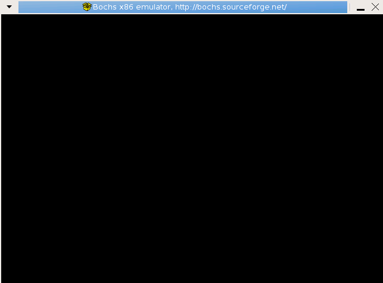

<meta http-equiv="content-type" content="text/html; charset=UTF-8">

Boot a PC
========

本文采用2007年的[版本](http://pdos.csail.mit.edu/6.828/2007/)。
原文链接(http://pdos.csail.mit.edu/6.828/2007/labs/lab1/lab1.html)

# 介绍
本节的实验被分为三部分。

- 第一部分：
> 1. 熟悉x86汇编语言
> 2. 使用Bochs x86仿真器。
> 3. PC上电开机启动过程。

-  第二部分
> 讲解了6.828内核使用的boot loader，这部分的代码位于lab1代码树的boot文件夹下。

- 第三部分
> 探讨了6.828内核的初始化部分，这个内核也称之为JOS，这部分代码位于kernel目录下。

# 环境搭建

首先你需要下载本次实验的[代码](http://pdos.lcs.mit.edu/6.828/2007/labs/lab1/lab1.tar.gz)。在开始实验之前。还需要一系列的准备工作，步骤如下。

## 第一步 下载资源
找一台Linux机器，推荐CentOS 5.6版本。安装好git与c,c++之后。执行命令如下：

	cd /opt/
	git clone https://github.com/JiYou/mit-6.828-docs.git
	cd mit-6.828-docs
	git checkout master

**注意** 寻找到CentOS 5.6的DVD光盘，在安装操作系统时，请选择Development Libraries和Development Tools。请务必使用CentOS 5.6版本，更新的发行版由于编译器更新，编译时，容易出现各种未知错误。安装时，务必将桌面系统也安装上。

## 第二步 安装Bochs

安装Bochs顺序如下：

	cd mit-6.828-docs # 此处为前面下载资源目录。
	mkdir -p ~/mit-6.828
	cp -rf Course1/bochs-2.2.6.tar.gz ~/mit-6.828/
	cd ~/mit-6.828/
	./configure --prefix=/usr \
			--enable-cdrom \
            --enable-disasm \
            --enable-smp \
            --enable-debugger \
            --enable-new-pit \
            --enable-all-optimizations \
            --enable-4meg-pages \
            --enable-global-pages \
            --enable-pae \
            --disable-reset-on-triple-fault \
            --with-all-libs \
            --with-x \
            --with-x11 \
            --with-nogui

如果看到如下输出，则说明configure成功：

	config.status: creating build/linux/bochs-dlx
	config.status: creating bxversion.h
	config.status: creating build/macosx/Info.plist
	config.status: creating build/win32/nsis/Makefile
	config.status: creating build/win32/nsis/bochs.nsi
	config.status: creating host/linux/pcidev/Makefile
	config.status: creating config.h
	config.status: creating ltdlconf.h

紧接着开始编译且安装源码包：

	make
	make install

各参数解释如下:

- --enable-cdrom: 支持CDROM
- --enable-disasm: 使得Bochs可以反汇编机器指令，disasm是disassemble的缩写。
- --enable-smp: 支持SMP配置。
- --enable-debugger: 使得用户可以使用bochs自带的调试器进行调试。
- --enable-new-pit: 使用新的更加完善的pit模块。
- --enable-all-optimizations： 打开所有的速度优化选项。
- --enable-4meg-pages: 支持4M页面扩展。
- --enable-global-pages: 支持全局页面特性。避免经常使用的页面从TLB中移出。
- --enable-pae: 支持特理地址扩展。
- --disable-reset-on-triple-fault: 关闭三次错误之后自动重启。
- --with-all-libs: 使用所有的库。
- --with-x: 使用Xwindows.
- --with-x11: 使用x11桌面系统。
- --with-nogui: 不使用幼稚的GUI。

**注意**

- 此处必须使用bochs-2.2.6.tar.gz，最好不要使用其他版本bochs。否则容易出现未知问题。
- C/C++是必须的在configure之前安装好的。
- 原MIT课程使用了Athena系统来提供学生的上机服务。此处用用自己的Linux实验过程来进行补充。所以看英文原版的就不用去想Athena是什么系统了。
- 使用越新的系统，由于gcc/g++版本越高，在编译旧版本的bochs时，容易遇到编译器的问题。因此，推荐使用**CentOS-5.6**系统。

## 第三步 启动Lab1

安装好Bochs之后，便可以开始Lab1实验了。编译步骤如下：

	cd ~/mit-6.828
	cp -rf /opt/mit-6.828-docs/Course1/lab1.tar.gz ./
	tar zxf lab1.tar.gz
	cd lab1
	make

接下来需要在GUI环境中，打开命令行:

	cd ~/mit-6.828/lab1
	bochs

得到如下输出：

	You can also start bochs with the -q option to skip these menus.

		1. Restore factory default configuration
		2. Read options from...
		3. Edit options
		4. Save options to...
		5. Begin simulation
		6. Quit now

	Please choose one: [5]
	输入5 

选择选项5，开始仿真。出现如下界面：

图1.1 运行bochs

此时bochs并没有任何输出。需要选中终端，终端中有如下内容：

	Next at t=0
	(0) [0xfffffff0] f000:fff0 (unk. ctxt): ljmp f000:e05b ; ea5be000f0
	<bochs:1>

输入c，表示继续执行，得到如下界面：

图1.2 内核初始运行画面。

如果能得到类似输出，表明Lab1执行成功。

# Part 1： 启动PC

第一个练习的目的在于让你熟悉x86汇编语言以及PC的开机启动过程，此外，也需要让你熟悉Bochs debugger。在本节实验中，你不需要写任何代码，但是你需要理解下面的知识，以确保能够正确地回答练习中的问题。

## 开始学习x86汇编
如果你并不熟悉汇编语言，那么，你需要尽快熟悉这门语言以应对这门课程。[The PC Assembly Language Book](http://pdos.csail.mit.edu/6.828/2007/readings/pcasm-book.pdf)是一本非常好的入门书籍。幸运之处在于，本书中能够找到大部分新旧材料。

**注意**
本书唯的缺陷之处在于使用的是NASM汇编语言，但是在6.828课程中，使用的却是GNU assembler。NASM使用的是Intel语法，而GNU assembler使用的却是AT&T语法。单从语法上而言，这两者写出来的代码差异很大，但是，这两者之间的转换却是非常简单，可以参考[Brennan's Guide to Inline Assembly](http://www.delorie.com/djgpp/doc/brennan/brennan_att_inline_djgpp.html).

这里提到的两本资料在https://github.com/JiYou/mit-6.828-docs/tree/master/Course1都可以找到。下载相应的资料即可。

<Read to 1.3.5 page 23>